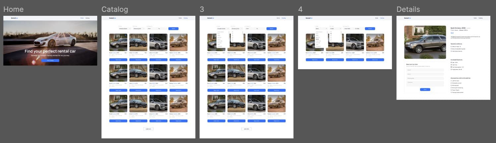
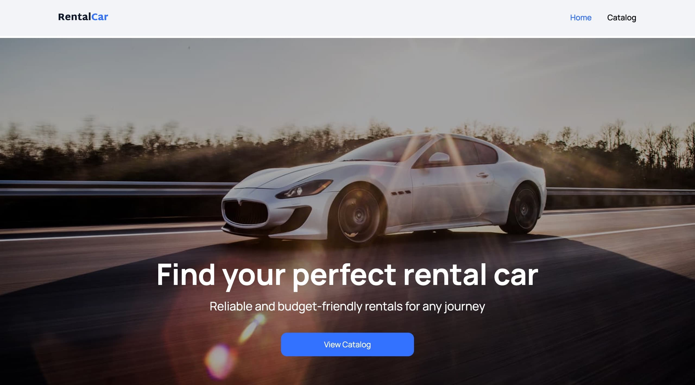
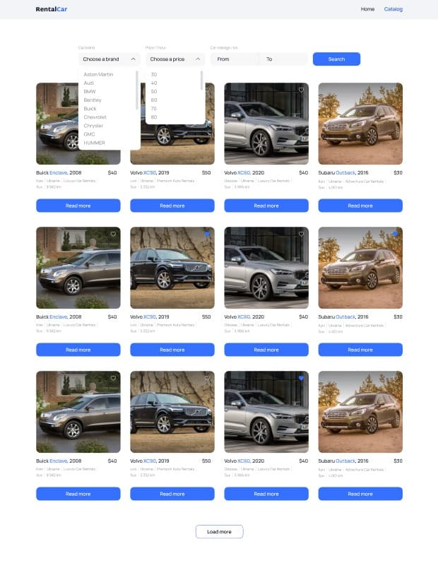
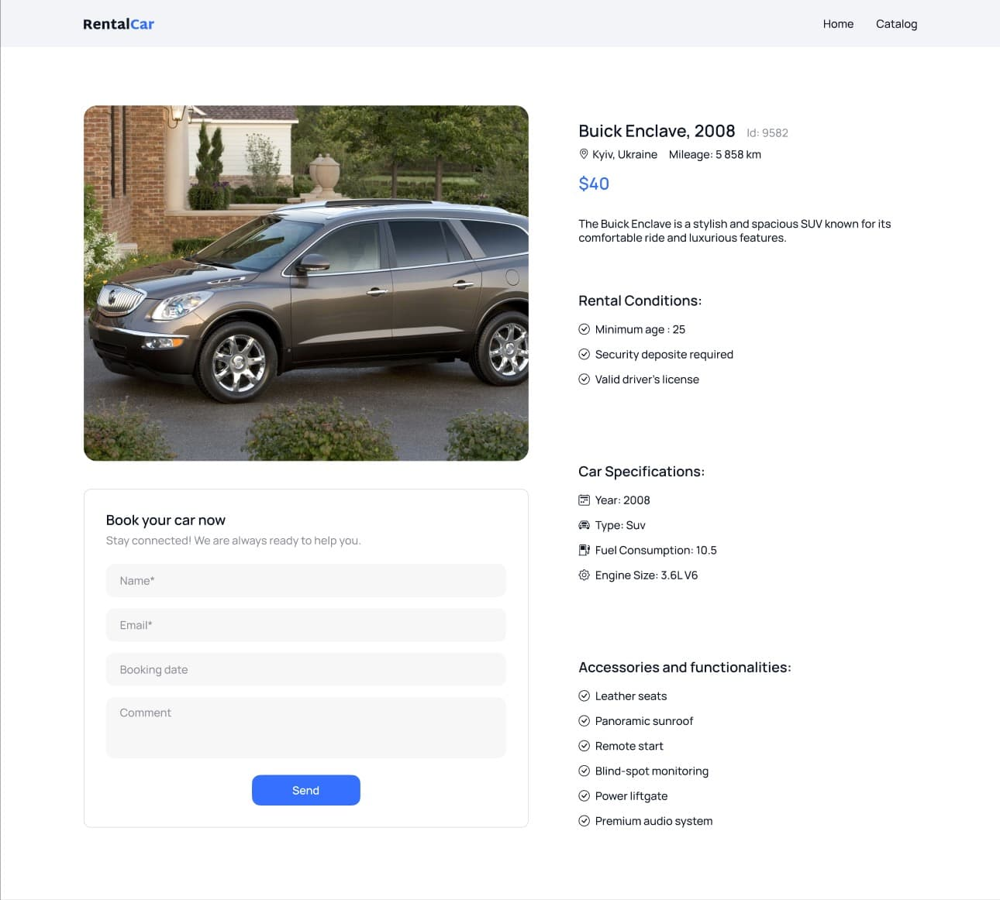

# 🚗 Car Rental Service

A modern, responsive web application for browsing and booking rental cars. Built with React, Redux, and featuring an intuitive interface with advanced filtering capabilities.



## 🌟 Features

- **📋 Car Catalog** - Browse a comprehensive list of available rental cars
- **🔍 Advanced Filtering** - Filter cars by brand, price, and mileage
- **❤️ Favorites** - Add cars to favorites for quick access
- **📅 Date Range Booking** - Select rental dates with an intuitive calendar
- **♿ Accessibility** - WCAG compliant with keyboard navigation support
- **⚡ Performance** - Optimized with lazy loading and memoization
- **💾 Persistent State** - Favorites saved to local storage

## 🛠️ Tech Stack

### Core
- **React** 18.3.1 - UI library
- **React Router DOM** 6.28.0 - Routing
- **Redux Toolkit** 2.3.0 - State management
- **Redux Persist** 6.0.0 - Persistent state

### Form Management
- **Formik** 2.4.6 - Form handling

### UI Components
- **React DatePicker** 7.5.0 - Date selection
- **React Select** 5.8.3 - Advanced dropdowns
- **React Toastify** 10.0.6 - Notifications
- **React Spinners** 0.14.1 - Loading indicators

### Utilities
- **Axios** 1.7.9 - HTTP client
- **clsx** 2.1.1 - Conditional classes
- **date-fns** 4.1.0 - Date formatting

### Development
- **Vite** 5.4.11 - Build tool
- **ESLint** 9.13.0 - Code linting

## 📦 Installation

### Prerequisites
- React.js "^19.1.1" or higher
- npm or yarn

### Setup

1. **Clone the repository**
```bash
git clone https://github.com/yourusername/car-rental-service.git
cd car-rental-service
```

2. **Install dependencies**
```bash
npm install
```

3. **Start development server**
```bash
npm run dev
```

4. **Build for production**
```bash
npm run build
```

5. **Preview production build**
```bash
npm run preview
```

## 🚀 Available Scripts

| Command | Description |
|---------|-------------|
| `npm run dev` | Start development server on `http://localhost:5173` |
| `npm run build` | Create production build in `/dist` folder |
| `npm run preview` | Preview production build locally |
| `npm run lint` | Run ESLint to check code quality |

## 📁 Project Structure

```
car-rental-service/
├── public/                  # Static assets
├── src/
│   ├── assets/             # Images, icons, SVG sprites
│   ├── components/         # React components
│   │   ├── App.jsx
│   │   ├── BookingForm/    # Booking form with date picker
│   │   ├── CarCard/        # Car card component
│   │   ├── CatalogList/    # List of cars with pagination
│   │   ├── Filter/         # Advanced filtering component
│   │   ├── Header/         # Navigation header
│   │   └── LoadMoreBtn/    # Load more button
│   ├── helpers/            # Helper functions
│   ├── pages/              # Page components
│   │   ├── HomePage/
│   │   ├── CatalogPage/
│   │   ├── CarDetailsPage/
│   │   └── NotFound/
│   ├── redux/              # Redux store and slices
│   │   ├── brands/         # Brands state
│   │   ├── cars/           # Cars state
│   │   ├── favourite/      # Favourites state
│   │   ├── filters/        # Filters state
│   │   └── store.js        # Redux store configuration
│   ├── services/           # API services
│   │   └── api.js          # Axios API calls
│   ├── utils/              # Utility functions
│   ├── main.jsx            # Application entry point
│   └── style.css           # Global styles
├── .eslintrc.cjs           # ESLint configuration
├── vite.config.js          # Vite configuration
└── package.json
```

## 🎯 Key Features Explained

### 1. Car Catalog
- Display cars in a responsive grid layout
- Lazy loading of car images
- Pagination with "Load More" functionality
- Empty state handling

### 2. Filtering System
- **Brand Filter** - Searchable dropdown with all available brands
- **Price Filter** - Filter by maximum hourly rental price
- **Mileage Range** - Set minimum and maximum mileage
- Real-time filtering with API integration

### 3. Favorites System
- Toggle favorite status with heart icon
- Persistent storage using Redux Persist
- Visual feedback for favorite items

### 4. Booking Form
- **Date Range Selection** - Choose start and end dates
- **Calendar Restrictions** - Cannot select past dates
- **Form Validation** - Required fields with error messages
- **Success Notification** - Toast notification on successful booking

### 5. Car Details Page
- Comprehensive car information
- High-quality car image
- Rental conditions and specifications
- Integrated booking form

## 🔧 Configuration

### API Configuration
The application uses the following API base URL:
```javascript
axios.defaults.baseURL = 'https://car-rental-api.goit.global';
```

### Available API Endpoints
- `GET /cars` - Fetch cars with optional filters
- `GET /cars/:id` - Fetch single car details
- `GET /brands` - Fetch all available brands

### Redux Persist
Only the `favorites` slice is persisted to local storage:
```javascript
const persistConfig = {
  key: 'root',
  storage,
  whitelist: ['favorites'],
};
```

## 🎨 Styling

The project uses **CSS Modules** for component-scoped styling:
- Each component has its own `.module.css` file
- Global styles in `src/style.css`
- Custom DatePicker theme in `react-datepicker.css`

### Color Palette
- Primary: `#3470FF`
- Primary Hover: `#0B44CD`
- Text: `#101828`
- Secondary Text: `#8D929A`
- Background: `#F7F7F7`
- Border: `#DADDE1`

## ♿ Accessibility Features

- Semantic HTML5 elements
- ARIA labels and roles
- Keyboard navigation support
- Focus indicators
- Screen reader friendly

## 🚀 Performance Optimizations

1. **React.memo** - Memoized components to prevent unnecessary re-renders
2. **useMemo & useCallback** - Memoized values and functions
3. **Lazy Loading** - Code splitting with React.lazy()
4. **Image Optimization** - Lazy loading images with `loading="lazy"`

## 🔐 Environment Variables

Create a `.env` file in the root directory:
```env
VITE_API_BASE_URL=https://car-rental-api.goit.global
```

## 📱 Browser Support

- Chrome (latest)
- Firefox (latest)
- Safari (latest)
- Edge (latest)

## 🤝 Contributing

1. Fork the repository
2. Create your feature branch (`git checkout -b feature/AmazingFeature`)
3. Commit your changes (`git commit -m 'Add some AmazingFeature'`)
4. Push to the branch (`git push origin feature/AmazingFeature`)
5. Open a Pull Request


## 👨‍💻 Author

**Olena Zhuvak**
- GitHub: [@ElenaZhuvak](https://github.com/ElenaZhuvak)
- LinkedIn: [Olena Zhuvak](https://www.linkedin.com/in/olena-zhuvak-9a8703125/)

## 🙏 Acknowledgments

- [GoIT](https://goit.global/) - For providing the API
- [React Icons](https://react-icons.github.io/react-icons/) - For icon resources
- Design inspiration from modern rental platforms

## 📸 Screenshots

### Home Page


### Catalog with Filters


### Car Details with Booking

---

**⭐ If you like this project, please give it a star on GitHub!**